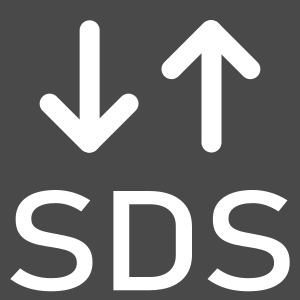

[](https://github.com/Open-CMSIS-Pack/vscode-cmsis-sds/blob/main/LICENSE)
[](https://securityscorecards.dev/viewer/?uri=github.com/Open-CMSIS-Pack/vscode-cmsis-sds)
[](https://github.com/Open-CMSIS-Pack/vscode-cmsis-sds/actions/workflows/ci.yml?query=branch:main)
[](https://github.com/Open-CMSIS-Pack/vscode-cmsis-sds/actions/workflows/markdown.yml?query=branch:main)
[](https://github.com/Open-CMSIS-Pack/vscode-cmsis-sds/actions/workflows/codeql.yml?query=branch:main)
[](https://github.com/Open-CMSIS-Pack/vscode-cmsis-sds/actions/workflows/dependency-review.yml?query=branch:main)

# Arm CMSIS SDS Tools for VS Code

VS Code extension for Arm Synchronous Data Stream (SDS) — record, view, and export sensor data using workspace-based configuration.

Part of the [OpenCMSIS](https://github.com/Open-CMSIS-Pack) ecosystem.
<br clear='all'/>

## Overview

The extension provides an integrated recording, playback, and analysis workflow for SDS data. A central **SDSIO configuration file** (`.sdsio.yml`) defines your workspace behavior, making it easy to switch between multiple project configurations and keep flag names and settings in source control.

## Key Features

### SDSIO Project Mode


- **Workspace Configuration** — Create and manage `.sdsio.yml` files that define workdir, metadir, and custom flag labels (0–7)
- **Config Switching** — Quickly open, create, or select a different `.sdsio.yml` within your workspace
- **Persistent Settings** — Active configuration is stored in `.vscode/settings.json` and restored on reload
- **Auto-Refresh** — Changes to `.sdsio.yml` are watched and automatically refresh the explorer and flags view

### Data Viewing & Analysis


- **SDS Viewer** — Interactive waveform visualization with cursor sync across multiple streams
- **Media Viewer** — View image, audio, and video SDS recordings
- **CSV Export** — Export SDS sensor data to CSV format

### SDSIO Monitor Interface


- **Live Flag Control** — Toggle up to 8 user-defined flags with custom labels (persisted in `.sdsio.yml`)
- **Record/Playback/Stop** — Control the SDSIO server directly from the SDS Interface view
- **Connection Status** — Visual indicator showing monitor socket connection state
- **Bundled Server** — Launch the included `tools/sdsio-server` binary with a single click

### Development


- **Metadata Editor** — Create and edit SDS metadata files (`.sds.yml`) in YAML format
- **Diagnostics** — Inspect extension events, server messages, and validation errors

## Getting Started

### 1. Create a Workspace Configuration


Open the SDS Tools sidebar (Activity Bar icon). Click **New SDS Configuration** and enter a name for your project (e.g., `target-a`). This creates a `target-a.sdsio.yml` file in your workspace root with a template.

The file looks like:

```yaml
sdsio:
  interface:
    usb:
  workdir: .
  metadir: .
  # flag-info:
  #   - 0: Flag 0
  #   - 1: Flag 1
```

### 2. Configure Paths & Flags

Edit your `.sdsio.yml` to set:

- `workdir` — directory where SDS recording files are saved (`.sds` files)
- `metadir` — directory containing metadata files (`.sds.yml` files)
- `flag-info` — custom labels for flags 0–7 (optional)

Example:

```yaml
workdir: ./recordings
metadir: ./metadata
flag-info:
  - 0: Start
  - 1: Trigger
  - 2: Error
```

### 3. Open a Recorder Session


Click the **Connect** button in the SDSIO Interface view (sidebar). If `tools/sdsio-server` is available, the extension launches it with your active `.sdsio.yml` as the control file. Once connected:

- **Record** — Start recording SDS data from the device
- **Play** — Play back previously recorded data
- **Flags** — Toggle flags 0–7 to control behavior on the device

Renamed flag labels appear immediately and persist in your `.sdsio.yml`.


### 4. View & Export Your Data

The SDS Files explorer shows all recordings and metadata in your configured `workdir` and `metadir`. Click on a `.sds` file to view it in the waveform viewer. Right-click to export to CSV.

If your recording contains images, audio, or video metadata, it opens in the Media Viewer instead.

## VS Code Controls Reference

### SDS Files Sidebar

| Control | Action |
|---------|--------|
| **Edit Configuration** | Opens the currently active `.sdsio.yml` file |
| **Select Configuration** | Pick a different `.sdsio.yml` from the workspace |
| **New Configuration** | Create a new `.sdsio.yml` file |
| **File List** | Click any `.sds` file to view it in the waveform viewer |
| **Refresh** | Rescan workspace for new recordings and metadata |

### SDSIO Interface Sidebar

| Control | Action |
|---------|--------|
| **Connect** | Launch the SDSIO server and establish monitor connection (only when disconnected) |
| **Record** | Begin recording (only when idle) |
| **Play** | Begin playback (only when idle) |
| **Stop** | Stop recording or playback (only when active) |
| **Flag Checkboxes** | Toggle individual flags 0–7; changes are sent to the device in real time |
| **Rename Flag** | Right-click a flag to rename it; the new label persists in your `.sdsio.yml` |
| **Connection Status** | Shows 🟢 connected or ⭕ disconnected |

## Typical Workflow

1. **Setup**: Create a `.sdsio.yml` project and configure `workdir`, `metadir`, and any custom flag labels.
2. **Connect**: Click the **Connect** button to start the SDSIO server.
3. **Record**: Use the **Record** button to start capturing data, toggle flags as needed.
4. **Stop**: Click **Stop** when done.
5. **View**: Click a `.sds` file in the explorer to view the waveform.
6. **Export**: Right-click and select **Export to CSV** to save sensor data in tabular form.
7. **Share**: Commit your `.sdsio.yml` to version control so teammates use the same configuration.

## File Structure

```txt
my-project/
├── my-config.sdsio.yml          # Project configuration
├── recordings/                   # SDS data files (workdir)
│   ├── accel.0.sds
│   ├── accel.1.sds
│   └── ...
├── metadata/                     # SDS metadata files (metadir)
│   ├── accel.sds.yml
│   └── ...
└── .vscode/
    └── settings.json             # Active config name stored here
```

## Building

```bash
npm install
npm run compile      # TypeScript compilation (development)
npm run watch        # Watch mode (compile on file changes)
npm run package      # Build VSIX (bundled + minified)
```

## Testing

```bash
npm run test:unit          # Unit tests (Vitest)
npm run test:integration   # Integration tests (Vitest)
npm run test:e2e           # E2E tests (Playwright)
```

## Learn More

- [SDS Framework Specification](https://github.com/ARM-software/SDS-Framework)
- [OpenCMSIS Pack](https://github.com/Open-CMSIS-Pack)

## License

Apache-2.0
